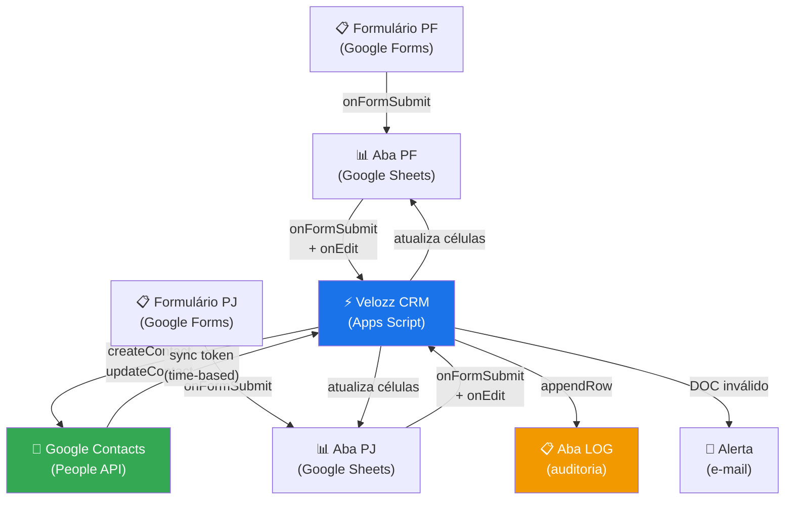

<div align="center">

# ⚡ Velozz CRM

### CRM leve e inteligente — Google Forms → Sheets → Contacts

**Transforme seus formulários em uma base de clientes sincronizada,
validada e rastreável — sem migrar, sem aprender um novo sistema.**

---

[](https://github.com/seu-usuario/velozz-crm/actions/workflows/pr-check.yml)
[](https://github.com/seu-usuario/velozz-crm/actions/workflows/deploy.yml)
[](https://github.com/seu-usuario/velozz-crm/actions)
[](LICENSE)
[](https://developers.google.com/apps-script/guides/v8-runtime)
[](https://nodejs.org)

---

[🚀 Deploy em 5 minutos](#-getting-started) ·
[📋 Documentação](#-configuração) ·
[🗺️ Roadmap](#️-roadmap) ·
[💼 Licença Comercial](#-licença-e-comercialização)

---

> 🇧🇷 Português | [🇺🇸 English below](#english-version)

</div>

---

## O problema que o Velozz CRM resolve

Pequenas e médias empresas coletam leads via Google Forms mas os dados
ficam presos em planilhas — sem vínculo com a agenda do time, sem
validação de CPF/CNPJ, sem rastreamento de mudanças de contato.

Soluções tradicionais exigem migração, treinamento e assinatura mensal.

**O Velozz CRM funciona dentro do Google Workspace que você já usa.**

---

## ✨ Features

### 🛡️ Zero dados inválidos
CPF e CNPJ validados pelo algoritmo oficial da Receita Federal antes
de entrar no sistema. Documentos inválidos geram alerta automático
por e-mail e tag `revisar` no Google Contacts — sem perder o lead.

### 📋 Funciona com seus Google Forms existentes
Nenhuma migração. Nenhuma perda de histórico. O sistema se adapta
ao seu formulário — inclusive se você reordenar perguntas ou adicionar
campos novos.

### 🔄 Sincronização bidirecional inteligente
Edite onde quiser: na planilha ou direto na agenda do Google.
O Velozz CRM detecta o que mudou e propaga automaticamente nos dois
sentidos — sem duplicações, sem conflitos.

### ✏️ Correção de DOC sem fricção
Quando o operador precisa corrigir um CPF inválido, ele simplesmente
apaga o campo de notas no Google Contacts e digita só os números.
O sistema detecta, valida, formata e atualiza tudo — sem prefixos,
sem formatação manual.

### 🏷️ Rastreamento de mudanças com expiração automática
Telefone ou e-mail atualizados ganham as tags `novo-telefone` e
`novo-email` no Google Contacts — visíveis para todo o time.
As tags expiram automaticamente em 30 dias (configurável).

### ⚙️ SaaS-ready — multi-tenant sem alterar código
Cada cliente configura nome da empresa, estrutura da planilha, nomes
das tags e comportamento do sistema via interface gráfica. Zero linhas
de código alteradas entre instalações.

### 🚀 CI/CD com rollback automático
Deploy via GitHub Actions com lint, testes, cobertura e rollback
automático em caso de falha. Cada deploy gera uma versão numerada no
GAS para restauração imediata.

### 🔒 Proteção contra erros operacionais
Colunas internas (`ResourceName`, `Última Atualização`) protegidas
contra edição acidental. Lock service previne condições de corrida
em envios simultâneos. Deduplicação bloqueia cadastros repetidos pelo
mesmo CPF/CNPJ.

---

## 🏗️ Como funciona

### Fluxo de dados


### Os 4 triggers

| Trigger | Evento | Responsabilidade |
|---|---|---|
| `processarFormulario` | `onFormSubmit` | Valida DOC, deduplica, cria contato no Contacts, aplica tags |
| `syncPlanilhaParaContatos` | `onEdit` | Propaga edições da planilha para o Contacts, detecta mudanças de tel/email |
| `syncContatosParaPlanilha` | Time-based (horário) | Captura edições feitas direto no Contacts, corrige DOCs |
| `limparTagsExpiradas` | Time-based (diário, 3h) | Remove tags temporárias após 30 dias |

### Velozz CRM vs alternativas

| | Planilha manual | CRM pago | **Velozz CRM** |
|---|---|---|---|
| Validação CPF/CNPJ | ❌ | ✅ | ✅ |
| Sync com Google Contacts | ❌ | ✅ | ✅ |
| Funciona com Forms existente | ✅ | ❌ | ✅ |
| Sem assinatura mensal | ✅ | ❌ | ✅ |
| Rastreamento de mudanças | ❌ | ✅ | ✅ |
| Deploy em minutos | ✅ | ❌ | ✅ |
| Código aberto e auditável | ❌ | ❌ | ✅ |
| Customizável sem vendor lock-in | ❌ | ❌ | ✅ |

---

## 📐 Arquitetura

### Estrutura do projeto
```
velozz-crm/
├── src/
│   ├── config/
│   │   └── AppConfig.js          # Configuração SaaS multi-tenant
│   ├── services/
│   │   ├── ContactService.js     # People API (Google Contacts)
│   │   ├── SheetService.js       # Sheets API (mapeamento dinâmico)
│   │   ├── FormService.js        # Processamento de formulários
│   │   ├── TagService.js         # Tags + expiração automática
│   │   └── SyncOrchestrator.js   # Lógica de negócio dos fluxos
│   ├── validators/
│   │   └── DocumentValidator.js  # CPF/CNPJ (algoritmo Receita Federal)
│   ├── utils/
│   │   ├── Logger.js             # Log persistente em aba oculta
│   │   ├── LockManager.js        # Controle de concorrência
│   │   └── Formatter.js          # Formatação de dados
│   ├── triggers/
│   │   └── TriggerHandlers.js    # Entry points do GAS
│   └── ui/
│       └── SetupTenantDialog.html # Interface de configuração
├── tests/
│   ├── mocks/                    # Mocks dos serviços Google
│   ├── unit/                     # Testes unitários (Jest)
│   └── helpers/
│       └── TestFactory.js        # Fábrica de dados de teste
├── scripts/
│   └── bundle.js                 # Pipeline de build
└── .github/
    └── workflows/
        ├── deploy.yml            # CI/CD → Google Apps Script
        └── pr-check.yml         # Validação de pull requests
```

### Princípios de design

- **Injeção de dependência** — todas as classes recebem dependências
  no construtor; nenhuma instancia diretamente seus peers
- **Mapeamento dinâmico de colunas** — `SheetService.getColumnIndex()`
  localiza colunas pelo nome do cabeçalho; nunca por índice fixo
- **Single Responsibility** — `TriggerHandlers` só faz cola entre o
  runtime do GAS e os serviços; lógica de negócio vive em `SyncOrchestrator`
- **Configuração externalizada** — 100% dos parâmetros configuráveis
  via `PropertiesService`; zero constantes hardcoded para o cliente

---

## 🚀 Getting Started

### Pré-requisitos

- Conta Google Workspace ou Gmail com Google Contacts ativo
- Dois Google Forms criados (um para PF, um para PJ)
- Node.js 18 ou superior
- Conta GitHub (para CI/CD)
- `clasp` CLI: `npm install -g @google/clasp`

---

### PASSO 0 — Configure seus Google Forms

> ⚠️ **Este passo é crítico.** O Velozz CRM não cria formulários —
> ele se adapta aos seus. Configure os formulários antes do deploy.

**Formulário PF — perguntas obrigatórias (nesta ordem):**

| # | Pergunta | Tipo | Observação |
|---|---|---|---|
| — | *(Timestamp)* | Automático | Inserido pelo Forms — não criar |
| 1 | Tipo | Múltipla escolha | Opções: "Pessoa Física" / "Pessoa Jurídica" |
| 2 | Nome | Resposta curta | |
| 3 | Sobrenome | Resposta curta | |
| 4 | CPF | Resposta curta | |
| 5 | Endereço | Resposta curta | |
| 6 | Número | Resposta curta | |
| 7 | Complemento | Resposta curta | Opcional |
| 8 | Telefone | Resposta curta | |
| 9 | Email | Resposta curta | |

**Formulário PJ — perguntas obrigatórias:**

| # | Pergunta | Tipo |
|---|---|---|
| — | *(Timestamp)* | Automático |
| 1 | Tipo | Múltipla escolha (mesmas opções) |
| 2 | Nome Responsável | Resposta curta |
| 3 | Empresa | Resposta curta |
| 4 | CNPJ | Resposta curta |
| 5–9 | Endereço, Número, Complemento, Telefone, Email | Resposta curta |

**Como vincular o formulário à planilha:**
```
Formulário → aba "Respostas" → ícone de planilha (🟢)
→ "Selecionar planilha de destino"
→ Escolha sua planilha → selecione a aba correta (PF ou PJ)
```

> 💡 Os nomes das perguntas devem ser **exatamente iguais** aos
> configurados em `AppConfig.DEFAULTS` (ou ajustados via `setupTenant()`).

---

### PASSO 1 — Clone e instale dependências
```bash
git clone https://github.com/seu-usuario/velozz-crm.git
cd velozz-crm
npm install
```

---

### PASSO 2 — Crie o projeto no Google Apps Script
```bash
# Faz login no Google (abre o browser)
clasp login

# Cria um novo projeto GAS vinculado à sua planilha
# Acesse: script.google.com → Novo projeto → copie o Script ID
# Cole o Script ID abaixo:
```

Edite o `.clasp.json` com seu Script ID:
```json
{
  "scriptId": "SEU_SCRIPT_ID_AQUI",
  "rootDir": "dist"
}
```

---

### PASSO 3 — Configure os GitHub Secrets

No repositório GitHub: `Settings → Secrets and variables → Actions`

| Secret | Como obter |
|---|---|
| `CLASP_TOKEN` | Após `clasp login`, copie o conteúdo de `~/.clasprc.json` |
| `SCRIPT_ID` | Apps Script → ⚙️ Configurações → ID do script |
| `ALERT_EMAIL` | Seu e-mail Gmail para notificações |
| `GMAIL_APP_PASSWORD` | Gmail → Segurança → Senhas de app → gerar |
| `GH_TOKEN` | GitHub → Settings → Developer settings → PAT (scope: `contents:write`) |

---

### PASSO 4 — Primeiro deploy
```bash
# Opção A: via GitHub Actions (recomendado)
git add .
git commit -m "feat: initial deploy"
git push origin main
# O workflow deploy.yml é disparado automaticamente

# Opção B: deploy manual via CLI
npm run deploy
```

---

### PASSO 5 — Configure o tenant

1. Abra sua planilha no Google Sheets
2. Acesse o menu **⚙️ Velozz CRM → 🚀 Configurar Tenant**
3. Preencha as seções:
   - **Identidade**: nome da empresa, e-mail de alertas
   - **Estrutura das Abas**: nomes das abas e mapeamento de colunas
   - **Comportamento**: dias de expiração de tags, hora do sync
4. Clique em **🔍 Verificar Compatibilidade**
5. Se aprovado, clique em **💾 Salvar Configurações**

---

### PASSO 6 — Setup inicial
```
⚙️ Velozz CRM → ⚙️ Executar Setup Inicial
```

O setup irá:
- ✅ Validar estrutura das abas PF e PJ
- ✅ Adicionar colunas `Status`, `ResourceName`, `Última Atualização`
- ✅ Proteger as colunas internas contra edição acidental
- ✅ Criar a aba `LOG` (oculta e protegida)
- ✅ Configurar o trigger diário de limpeza de tags

---

### PASSO 7 — Configure os triggers no GAS

Acesse `script.google.com` → seu projeto → ⏰ Acionadores:

| Função | Evento | Implantação |
|---|---|---|
| `processarFormulario` | Da planilha — Ao enviar o formulário | - |
| `syncPlanilhaParaContatos` | Da planilha — Ao editar | - |
| `syncContatosParaPlanilha` | Por tempo — A cada hora | - |
| `limparTagsExpiradas` | Por tempo — Todo dia (3h) | *(criado automaticamente pelo setup)* |

> ⚠️ `processarFormulario` deve ser criado manualmente uma vez para
> que o GAS solicite as permissões necessárias (OAuth).

---

## ⚙️ Configuração

### Propriedades configuráveis

Todas as configurações são armazenadas em `PropertiesService.getScriptProperties()`
e podem ser alteradas via **⚙️ Velozz CRM → Configurar Tenant**.

#### Identidade

| Propriedade | Padrão | Descrição |
|---|---|---|
| `COMPANY_NAME` | `"Minha Empresa"` | Nome exibido nos e-mails de alerta |
| `SPREADSHEET_NAME` | `"Cadastro de Clientes"` | Documentação (não altera o arquivo) |
| `ALERT_EMAIL` | *(email do owner)* | Destinatário dos alertas de DOC inválido |

#### Abas

| Propriedade | Padrão | Descrição |
|---|---|---|
| `SHEET_PF` | `"PF"` | Nome da aba vinculada ao Formulário PF |
| `SHEET_PJ` | `"PJ"` | Nome da aba vinculada ao Formulário PJ |
| `SHEET_LOG` | `"LOG"` | Nome da aba de log (oculta) |

#### Mapeamento de colunas

| Propriedade | Padrão | Descrição |
|---|---|---|
| `COL_TIMESTAMP` | `"Data"` | ⚠️ Inserida automaticamente pelo Forms |
| `COL_TIPO_PESSOA` | `"Tipo"` | Pergunta de roteamento PF/PJ |
| `COL_NOME_PF` | `"Nome"` | Nome no formulário PF |
| `COL_SOBRENOME_PF` | `"Sobrenome"` | |
| `COL_DOC_PF` | `"CPF"` | |
| `COL_NOME_RESPONSAVEL` | `"Nome Responsável"` | Nome no formulário PJ |
| `COL_EMPRESA` | `"Empresa"` | |
| `COL_DOC_PJ` | `"CNPJ"` | |
| `COL_ENDERECO` | `"Endereço"` | Comum a PF e PJ |
| `COL_NUMERO` | `"Número"` | |
| `COL_COMPLEMENTO` | `"Complemento"` | |
| `COL_TELEFONE` | `"Telefone"` | |
| `COL_EMAIL` | `"Email"` | |
| `COL_STATUS` | `"Status"` | *(adicionada pelo script)* |
| `COL_RESOURCE` | `"ResourceName"` | *(adicionada e oculta pelo script)* |
| `COL_SYNC` | `"Última Atualização"` | *(adicionada e oculta pelo script)* |

#### Comportamento

| Propriedade | Padrão | Descrição |
|---|---|---|
| `TAG_ALERT_NAME` | `"revisar"` | Tag para DOC inválido |
| `TAG_PHONE_NAME` | `"novo-telefone"` | Tag para mudança de telefone |
| `TAG_EMAIL_NAME` | `"novo-email"` | Tag para mudança de e-mail |
| `TAG_EXPIRY_DAYS` | `"30"` | Dias até expiração das tags temporárias |
| `LOCK_TIMEOUT_MS` | `"10000"` | Timeout do lock (ms) |
| `SYNC_HOUR` | `"3"` | Hora do trigger diário (0–23) |

---

### FAQ

**E se eu reordenar as perguntas do formulário?**

Nenhum problema. O Velozz CRM localiza colunas pelo **nome do cabeçalho**,
não pela posição. Se você mover o campo "CPF" da posição 4 para a posição 7,
o sistema continua funcionando — desde que o nome da pergunta não mude.

**E se eu renomear uma pergunta?**

Atualize a propriedade `COL_*` correspondente via
**⚙️ Velozz CRM → Configurar Tenant → Estrutura das Abas**.
O botão **🔍 Verificar Compatibilidade** confirma que tudo está alinhado
antes de salvar.

**Posso usar com formulários em inglês?**

Sim. Configure os `COL_*` com os nomes em inglês.
Ex: `COL_NOME_PF = "First Name"`, `COL_DOC_PF = "Tax ID"`.

**Como faço rollback de um deploy problemático?**
```bash
# Lista versões disponíveis
npx clasp versions

# Restaura uma versão específica
npx clasp deploy --versionNumber <numero>
```

Ou acione o workflow manualmente no GitHub: `Actions → Deploy → Run workflow`.

**O que acontece se dois formulários forem enviados ao mesmo tempo?**

O `LockService` garante que apenas um seja processado por vez.
O segundo aguarda até 10 segundos (configurável via `LOCK_TIMEOUT_MS`).
Se o lock não for obtido, o status é marcado como
`"Aguardando lock — tente novamente"` para reprocessamento.

---

## 📡 Triggers e API Interna

### `processarFormulario(e)` — onFormSubmit

| | |
|---|---|
| **Evento** | Envio de formulário (PF ou PJ) |
| **Responsabilidade** | Valida DOC · Deduplica · Cria contato · Aplica tags |
| **Side effects** | Escreve linha na planilha · Cria contato no Contacts · Envia e-mail se DOC inválido |
| **Quota API** | ~3–5 chamadas (createContact + 2–3 modify de grupo) |
| **Lock** | ✅ Script lock (10s timeout) |

### `syncPlanilhaParaContatos(e)` — onEdit

| | |
|---|---|
| **Evento** | Edição em qualquer célula das abas PF ou PJ |
| **Responsabilidade** | Propaga edição para Contacts · Detecta mudança de tel/email |
| **Guard** | Ignora edições nas colunas K/L (evita loop) · Ignora linhas sem ResourceName |
| **Side effects** | updateContact · Pode aplicar tags temporárias |
| **Quota API** | ~2–4 chamadas (get + update + 0–2 modify) |
| **Lock** | ✅ Script lock (10s timeout) |

### `syncContatosParaPlanilha()` — time-based (horário)

| | |
|---|---|
| **Evento** | Trigger horário |
| **Responsabilidade** | Busca contatos alterados · Corrige DOC · Atualiza tel/email na planilha |
| **Mecanismo** | Sync token (só processa contatos alterados desde o último ciclo) |
| **Side effects** | Atualiza células na planilha · Pode aplicar/remover tags · Envia e-mail se correção falhar |
| **Quota API** | 1 (Connections.list) + N×3 por contato alterado |

### `limparTagsExpiradas()` — time-based (diário, 3h)

| | |
|---|---|
| **Evento** | Trigger diário criado pelo `setupInicial()` |
| **Responsabilidade** | Remove tags `novo-telefone` e `novo-email` expiradas |
| **Armazenamento** | `ScriptProperties` (chaves `TAG_EXPIRY_*`) |
| **Quota API** | 1 por tag expirada (ContactGroups.Members.modify) |

---

## 🧪 Testes

### Executar localmente
```bash
# Todos os testes
npm test

# Com cobertura
npm run test:coverage

# Watch mode (desenvolvimento)
npm run test:watch
```

### Suites disponíveis

| Suite | O que testa |
|---|---|
| `DocumentValidator.test.js` | CPF/CNPJ válidos · inválidos · todos os edge cases · detecção de correção do operador |
| `Formatter.test.js` | Telefone 10/11 dígitos · CPF/CNPJ com máscara · normalização de email · zeros à esquerda |
| `SheetService.test.js` | `getColumnIndex()` por cabeçalho · cache · coluna movida · coluna extra do cliente · deduplicação |
| `TagService.test.js` | Aplicar · remover · expirar · renovar timer · detectar mudança de tel/email |
| `FormService.test.js` | Extração de PF/PJ · campos ausentes · payload do contato · endereço composto |

### Como mockar o Google Forms nos testes
```javascript
// Crie um evento de formulário simulado:
const event = TestFactory.formEventPF({
  'CPF': ['529.982.247-25'],  // sobrescreve o campo CPF
  'Email': ['novo@email.com'],
});

// Use diretamente em formService.extractFormData(event, 'PF')
```

---

## 🗺️ Roadmap

### v1.1 — Formulários avançados
- [ ] Suporte a formulários com seções condicionais (lógica de ramificação)
- [ ] Suporte a múltiplos formulários por tipo (ex: PF Varejo + PF B2B)

### v1.2 — Observabilidade
- [ ] Dashboard web standalone com histórico de sincronizações e métricas
- [ ] Buffer de logs com flush em batch (reduz chamadas à Sheets API)

### v1.3 — Integrações
- [ ] Webhook outbound para notificar sistemas externos a cada novo cadastro
- [ ] Exportação para CSV/XLSX com filtros configuráveis

### v2.0 — Plataforma
- [ ] Painel de licenças para revendedores (multi-tenant management)
- [ ] API REST para integrações externas via Google Cloud Run
- [ ] Suporte a campos customizados além do conjunto padrão PF/PJ

---

## 💼 Licença e Comercialização

### Licença MIT (uso pessoal e open source)
```
MIT License — Copyright (c) 2026 Seu Nome

Permission is hereby granted, free of charge, to any person obtaining
a copy of this software and associated documentation files, to deal in
the Software without restriction, including without limitation the rights
to use, copy, modify, merge, publish, distribute, sublicense, and/or
sell copies of the Software.
```

Veja o arquivo [LICENSE](LICENSE) para o texto completo.

### Licença Comercial

Para uso em produtos SaaS, revenda ou implantação em clientes
sem divulgação do código-fonte, uma licença comercial é necessária.

**A licença comercial inclui:**
- ✅ Direito de uso em produtos proprietários
- ✅ Direito de revenda para clientes finais
- ✅ Suporte técnico por e-mail (30 dias)
- ✅ Acesso a releases privadas com features antecipadas

**Contato:** [seu@email.com](mailto:seu@email.com)

---

## 👤 Autor

**Seu Nome**

[](https://github.com/seu-usuario)
[](https://linkedin.com/in/seu-perfil)
[](mailto:seu@email.com)

---

<div align="center">

Feito com ☕ e muito Google Apps Script

*Se este projeto foi útil, deixe uma ⭐ no GitHub*

</div>

---

---

# English Version

<a name="english-version"></a>

<div align="center">

# ⚡ Velozz CRM

### Lightweight, intelligent CRM — Google Forms → Sheets → Contacts

**Turn your forms into a synchronized, validated, and trackable
client database — without migrating, without learning a new system.**

</div>

---

## The problem Velozz CRM solves

Small and medium businesses collect leads via Google Forms but data
stays trapped in spreadsheets — disconnected from the team's contacts,
no CPF/CNPJ validation, no change tracking.

Traditional solutions require migration, training, and monthly fees.

**Velozz CRM works inside the Google Workspace you already use.**

---

## ✨ Features

- 🛡️ **Zero invalid data** — CPF and CNPJ validated by the official
  Brazilian Revenue algorithm before entering the system
- 📋 **Works with your existing Google Forms** — no migration,
  adapts to your form structure including reordered questions
- 🔄 **Bidirectional sync** — edit in the spreadsheet or Google
  Contacts; the system detects and propagates changes automatically
- ✏️ **Frictionless DOC correction** — operator types just the digits,
  system detects, validates, formats and updates everything
- 🏷️ **Change tracking with auto-expiry** — `new-phone` and `new-email`
  tags in Google Contacts, auto-removed after 30 days
- ⚙️ **SaaS-ready multi-tenant** — zero code changes between clients
- 🚀 **CI/CD with automatic rollback** — GitHub Actions pipeline

---

## 🚀 Quick Start (5 minutes)
```bash
git clone https://github.com/seu-usuario/velozz-crm.git
cd velozz-crm
npm install
clasp login
# Edit .clasp.json with your Script ID
npm run deploy
```

Then open your Google Sheet:
**⚙️ Velozz CRM → Configure Tenant → Run Setup**

See the [full Getting Started guide](#-getting-started) above
(translated equivalents apply).

---

## 📄 License

MIT for open source use.
Commercial license available for SaaS and resale.
Contact: [seu@email.com](mailto:seu@email.com)